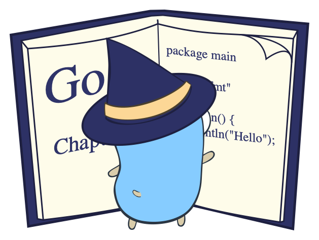
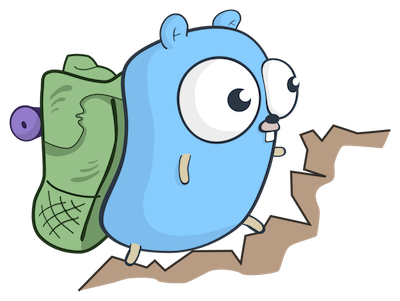
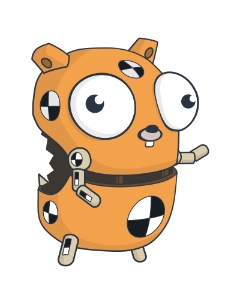
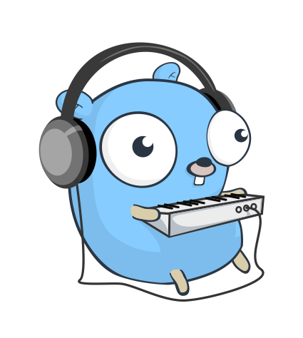

# Fundamentals of Go



Hello, and welcome to learning Go! It's great to have you here.

## What's this?

This is a set of introductory exercises in Go programming, suitable for complete beginners. If you don't know anything about Go yet, or programming, but would like to learn, you're in the right place!

(If you do already know something about Go, you should find these exercises relatively straightforward, but still worth doing.)

## Is there an ebook to accompany these exercises?

Absolutely. [For the Love of Go: Fundamentals](https://bitfieldconsulting.com/books/fundamentals) is a downloadable ebook which guides you through every step of the process, from installing Go to explaining all the ins and outs of test-driven development. It also contains almost all the code you'll need to solve these exercises, with full details of how it works.

[](https://bitfieldconsulting.com/books/fundamentals)

You don't need to buy the book to work through these exercises, though it'll definitely help! But if you do buy it, you'll be helping support me and my work, including developing new exercises and books, and mentoring people from non-traditional backgrounds to help them into tech and software development careers. Which would be amazing! You can also [sponsor me on GitHub](https://github.com/sponsors/bitfield).

You can find more Go books here in my online shop:

* [For the Love of Go](https://bitfieldconsulting.com/books)

## What you'll learn

In this set of exercises, you'll learn:

* How to run tests for a Go program
* How to automatically format your Go code correctly
* The basic pattern that all Go tests should follow
* How to declare and import Go _packages_ (units of code)
* How to design multiple _test cases_ and use them in your tests
* How to test error handling in your programs
* A simple, reliable, test-first development workflow

## How to do the exercises

Each exercise is described in a separate section of this README file. Each section briefly explains what the exercise is about, and outlines what you'll be doing. There'll be one or more goals for you to achieve, marked with **GOAL:** in bold. (Don't worry if you're not sure how to do it. There'll usually be some helpful suggestions following the goal description.)

If you're finding the goals easy, or want a bit more of a challenge, there are some _stretch goals_, too. These are optional; if you're not interested or not ready to tackle them, just skip over them.

So let's get started!

# 1: Testing times


It's your first day as a Go developer at Texio Instronics, a major manufacturer of widgets and what-nots, and you've been assigned to the Future Projects division to work on a very exciting new product: a Go-powered electronic calculator! Welcome aboard.

In this exercise, all you need to do is make sure your Go environment is set up and everything is working right.

One of your new colleagues has already made a start on the calculator project.  She's placed a Go package in the [`calculator.go`](calculator.go) file, and an accompanying test in [`calculator_test.go`](calculator_test.go). You're going to run this test and make sure it passes.

**GOAL:** Successfully run the test.

**STRETCH GOAL:** Use your editor's Go support features to run the test directly in the editor. For example, in Visual Studio Code, there's a little 'Run test' link above each test function, and a 'Run package tests' link at the top of the file. Find out how to do this in the editor you're using.

# 2: Getting in shape



The next thing to do is ensure that your Go code is formatted correctly. All Go code is formatted in a standard way, using a tool called `gofmt` (pronounced, in case you were wondering, 'go-fumpt'). In this exercise you'll see how to use it to check and reformat your code (if necessary).

The file `calculator.go` in this directory contains a deliberate formatting mistake, just to make sure you're on your toes!

**GOAL:** Run `gofmt` to check the formatting and find out what is wrong.

**GOAL:** Use `gofmt` to fix the formatting automatically.

**STRETCH GOAL:** Experiment with `gofmt`. Try formatting your code in different ways and see what changes `gofmt` makes to it. It's interesting to note what it does and doesn't change.

# 3: Fixing a hole


Now that your development environment is all set up, your colleague needs your help. She has been working on getting the calculator to subtract numbers, but there's a problem: the test is not passing. Can you help?

You'll find the test code commented out in the `calculator_test.go` file:

```go
// func TestSubtract(t *testing.T) {
// 	t.Parallel()
// 	var want float64 = 2
// 	got := calculator.Subtract(4, 2)
// 	if want != got {
// 		t.Errorf("want %f, got %f", want, got)
// 	}
// }

```

**GOAL:** Get this test passing!

**STRETCH GOAL:** Find out what other ways there are to fail a test using the `testing.T`. What other methods does it have? Do any of them look potentially useful?

# 4: Go forth and multiply


Excellent work! You now have a calculator which can add and (correctly) subtract. That's a great start. Let's turn to multiplication now.

Up to now you've been running existing tests and modifying existing code. For the first time you're going to write the test, and the function it's testing!

**GOAL:** Write a test for a function `Multiply()` which, just like the `Add()` and `Subtract()` functions, takes two numbers as parameters, and returns a single number representing the result.

**GOAL:** Write the minimum code necessary to get the test to compile and fail.

**GOAL:** Write the minimum code necessary to get `TestMultiply` to pass.

Why did we say "the minimum code necessary"? Because, in a sense, the test itself defines what `Multiply` needs to do. Once it does that, and the test passes, we should _stop coding_.

**GOAL:** Make `TestMultiply` fail deliberately.

There's one final step required for us to be really sure that both the test and the code are correct. We need to see the test fail again. To do this, change the expected return value from `Multiply` to something that you know is wrong, and run `go test` again.

**STRETCH GOAL:** Think about other ways this test could be wrong. Try some of them out. What happens? What could you do to catch such potential problems?

Nice work! Go on to the next section.

# 5: Testing to destruction



Now that you've successfully designed and implemented a new calculator feature, test-first, it's time to think a little more about testing, and how you can extend it. The `Add`, `Subtract`, and `Multiply` functions are so simple that it's fairly difficult (though not at all impossible) to get them wrong. If `TestAdd` passes for one set of inputs, for example, it's hard to imagine other inputs that would make it fail.

But this doesn't apply to more complicated functions, where it's quite likely that they could work correctly for some inputs, but not for others. In this situation it will be a good idea to test multiple _cases_ for each function: that is to say, different inputs with different expected results.

**GOAL:** Define a struct type suitable for expressing test cases for your calculator functions. It should include the test inputs, and the expected output.

**GOAL:** Declare a slice of test cases for `TestAdd`, using your struct type, and rewrite the test function to loop over them, testing each case in turn.

**GOAL:** Rewrite `TestSubtract`, and `TestMultiply` to test multiple cases for each function, too. Try to think of interesting and varied test cases: for example, negative numbers, zeroes, fractional numbers.

As before, once each test is passing, break it deliberately and make sure it fails in the expected way, with a helpful failure message.

**STRETCH GOAL:** Add a string field `name` to your test cases, and supply a human-readable name for each case. For example, a test case for `Add` might be named `"Two negative numbers which sum to a positive"`. Output the name of the test case along with the failure message.

When you're happy with the expanded tests, move on to the next section.

# 6: Errors and expectations


The board reviewed the calculator project yesterday, and they're really pleased with your progress! The only remaining major feature to be completed is division, and that needs a little more thought than the others.

Why? Because it's possible to write division expressions that have _undefined_ results. For example:

```
6 / 0
```

This looks reasonable at first sight, but what we're really asking here is "What number, multiplied by zero, gives 6?" And clearly there is no such number. What should our calculator do in this case?

## Functions that return errors

The standard way to do this in Go is to write a function signature like:

```go
func Divide(a, b float64) (float64, error)
```

**GOAL:** Define a test case struct type which allows us to test both valid and invalid inputs to `Divide`.

We need a way for the test case to specify whether or not the given inputs should produce an error. The simplest way to do that is to use a `bool` value, which we could call something like `errExpected`. If this value is `true`, it's saying the test case should cause `Divide` to return a non-nil error.

**GOAL:** Write a set of test cases for `Divide` using the new struct type. Make sure to include both valid and invalid inputs.

**GOAL:** Write the necessary logic for the `TestDivide` function, handling each of the possible outcomes correctly.

**GOAL:** Write the minimum code necessary to make `TestDivide` pass.

When your test cases all pass, and you've verified them all by deliberately breaking their expectations, and you've checked that the test outputs the correct failure message for unexpected error statuses, then you can move on to the next (and final) section.

**STRETCH GOAL:** Write a new test for one or more of your functions which generates _random_ test inputs instead of using prepared cases (you can use the `math/rand` library for this). For example, you might write a `TestAddRandom` function which generates two random `float64` values, sums them to get the expected result (_not_ using the `Add` function!), and calls `Add` to verify that it returns the same answer. Do this many times, say, a hundred times, to give the function a good workout.

# 7: Roots music



Well done! That was a good piece of work getting the test cases and error handling set up for the `Divide` function. In fact, you now know just about everything you need to write great tests in Go!

## The structure of tests

All tests follow more or less the same basic structure:

* Define the test cases with their inputs and expected outputs (including any error outputs)
* Iterate over the test cases, calling the function under test with each set of inputs
* Check that the outputs match expectations, and fail otherwise with some helpful output

And you've also practiced a specific workflow, or sequence of actions, that you can use when developing any piece of Go code:

## The development process

1. Start by writing a test for the function (even though it doesn't exist yet)
2. See the test fail with a compilation error because the function doesn't exist yet.
3. Write the minimum code necessary to make the test compile and fail.
4. Make sure that the test fails for the reason you expected.
5. Write the minimum code necessary to make the test pass.
6. Change the test expectations to deliberately make the test fail, and check that the failure message is accurate and informative.
7. Restore the original expectations and make sure the test still passes.
8. Commit!

In practice, we may go through this loop a few times with any particular test. We start with something very simple, so that we are never facing an insurmountable problem. If we are, then we try to break that problem down into smaller problems, and repeat this process with those.

## A `Sqrt` function

Our basic calculator is complete, but you've just received an urgent message from the VP of Sales. She wants an extra premium feature which can be used to upsell users to the 'Enterprise' calculator. The ordinary calculator has been re-branded as the 'Home' edition.

It seems that enterprise users would like the ability to take square roots, so the VP's asking you to develop a `Sqrt` function. You already know everything you need to know to design, test, and develop this feature, so let's get started!

**GOAL:** Develop a `Sqrt` function which takes a `float64` value and returns its square root as a `float64` value.

You can use any standard or third-party libraries you think are appropriate. The function should return an error for negative inputs (no real number squared equals a negative number, so taking the square root of a negative number is not a valid operation). Your test should check the error handling in the same way as the test for `Divide`.

When the feature is complete to your own satisfaction, you're done! Nice work. The company has awarded you a sizeable bonus, and an all-expenses-paid vacation. Enjoy it!

**STRETCH GOAL:** Extend your existing tests and functions to allow _two or more_ inputs to `Add`, `Subtract`, `Multiply`, and `Divide`. For example, calling `Divide(12, 4, 3)` should divide 12 by 4, divide the result of that by 3, then return _that_ result. Calling `Multiply` with ten inputs should return the result of multiplying them all together.

**STRETCH GOAL 2:** Write a function which accepts strings of the form `12 * 3`, for example, and returns the result. You only need to handle expressions which have a single floating-point value, followed by a single operator, followed by a single floating-point value, ignoring any whitespace. For example, the following should all be valid inputs to your function:

```
2*2
1 + 1.5
18   /   6
100-0.1
```

## Who wrote this?

[John Arundel](https://bitfieldconsulting.com/about) is a Go teacher and mentor of many years experience. He's helped literally thousands of people to learn Go, with friendly, supportive, professional mentoring, and he can help you too! Find out more:

* [Learn Go with mentoring](https://bitfieldconsulting.com/golang/learn)

## Has it been published as a friendly, low-priced ebook?

Yes. We've been over this. You can buy the book, which covers all the exercises in much more detail, including a complete step-by-step guide to solving them, here:

* [For the Love of Go: Fundamentals](https://bitfieldconsulting.com/books/fundamentals)

And now there's a sequel! 'For the Love of Go: Data' takes what we've learned here, and applies it to building the core functionality of a cool online bookstore. Along the way we'll find out about Go's basic data types, defining our own struct types, manipulating collections of data using slices and maps, and much more!

* [For the Love of Go: Data](https://bitfieldconsulting.com/books/data)

## What's next?

You might like to try another set of exercises in this series:

* [The G-machine](https://github.com/bitfield/gmachine) guides you through the development of a simplified virtual CPU in Go, complete with its own machine language. Along the way you'll learn some useful computer science fundamentals.

## Further reading

You can find more Go tutorials and exercises here:

* [Go tutorials from Bitfield](https://bitfieldconsulting.com/golang)

<small>Gopher images by the magnificent [egonelbre](https://github.com/egonelbre/gophers)</small>
